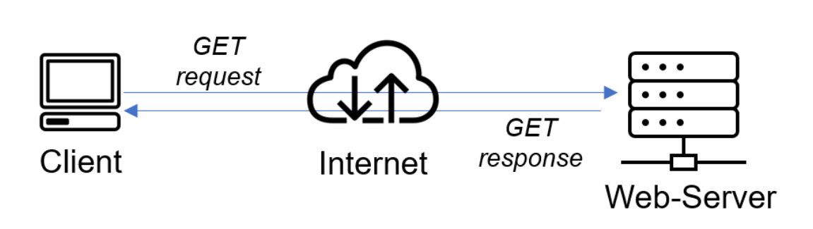

## **CLIENT-SERVER ARCHITECTURE WITH MYSQL**

Client-Server architecture refers to a system that hosts and delivers resources and services over a network requested by a client from a server.

The machine making the request is the client while the machine delivering the request is the server.

For this project we wil be using two EC2 instances. One as a server while the other as a client.

1. Create and configure two Linux-based virtual servers (EC2 instances in AWS).

    `Server A sudo apt install mysql-server`
    
    `Server B: sudo apt install mysql-client`

- By default, both of your EC2 virtual servers are located in the same local virtual network, so they can communicate to each other using local IP addresses. Use mysql server's local IP address to connect from mysql client. MySQL server uses TCP port 3306 by default, so you will have to open it by creating a new entry in ‘Inbound rules’ in ‘mysql server’ Security Groups. For extra security, do not allow all IP addresses to reach your ‘mysql server’ – allow access only to the specific local IP address of your ‘mysql client’

- Next after installing mysql, we check if the service is running by applying the below code.

    `sudo systemctl status mysql`

- Next we apply a root password for our mysql by using the below code and following the prompt.

    `sudo mysql_secure_installation`

- Next we go into our mysql using the below code. we will get prompt to ase our password.

    `sudo -u root -p`

- On a side note, we can set a password by using the below code

    `ALTER USER 'root'@'localhost' IDENTIFIED WITH mysql_native_password BY 'SetRootPasswordHere';`

2. Next we need to configure MYSQL server to allow connections from remote hosts.

    `sudo vi /etc/mysql/mysql.conf.d/mysqld.cnf`

- we edit the bind address to change the IP as shown below, replacing ‘127.0.0.1’ to ‘0.0.0.0’.

- restart the mysql server

    `sudo systemctl restart mysql`

- Next we create a user and a database and give it all privileges to the database created.

    `sudo -u root -p`

    `CREATE USER 'remote_user'@'%' IDENTIFIED WITH mysql_native_password BY 'password';`

    `CREATE DATABASE test_db;`

    `GRANT ALL ON test_db.* TO 'remote_user'@'%' WITH GRANT OPTION;`

    `FLUSH PRIVILEGES;`

3. Finally, we go to the mysql client linux server to connect remotely to the mysql server database engine. To do that we first get the IP.

    `ip addr show`

    `sudo mysql -u remote_user -h private_ip_address -p`

- This will prompt for a password.

- We can run commands here such as show databases and some query.

## **THANK YOU**